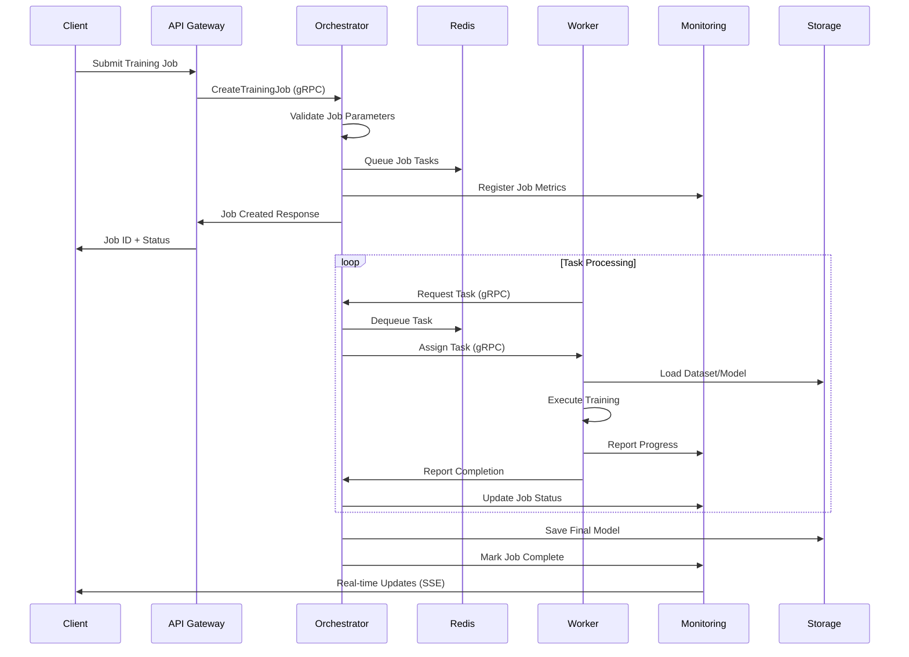

# TensorFleet Architecture Guide
## Comprehensive System Architecture Documentation

---

## Table of Contents
1. [System Overview](#system-overview)
2. [Microservices Architecture](#microservices-architecture)
3. [Data Flow](#data-flow)
4. [Communication Patterns](#communication-patterns)
5. [Scalability Design](#scalability-design)
6. [Security Architecture](#security-architecture)
7. [Deployment Architecture](#deployment-architecture)

---

## System Overview

### High-Level Architecture Diagram

```
┌─────────────────────────────────────────────────────────────────────────────┐
│                            TensorFleet Platform                             │
│                          Distributed ML Training                            │
└─────────────────────────────────────────────────────────────────────────────┘

┌─────────────────┐    ┌─────────────────┐    ┌─────────────────────────────┐
│   Client Layer  │    │  Gateway Layer  │    │      Service Layer          │
│                 │    │                 │    │                             │
│ ┌─────────────┐ │    │ ┌─────────────┐ │    │ ┌─────────┐ ┌─────────────┐ │
│ │  Frontend   │◄┼────┼►│ API Gateway │◄┼────┼►│Orchestr.│ │ Monitoring  │ │
│ │   (React)   │ │    │ │    (Go)     │ │    │ │  (Go)   │ │  (Python)   │ │
│ └─────────────┘ │    │ └─────────────┘ │    │ └─────────┘ └─────────────┘ │
│                 │    │                 │    │                             │
│ ┌─────────────┐ │    │ ┌─────────────┐ │    │ ┌─────────┐ ┌─────────────┐ │
│ │   Mobile    │◄┼────┼►│Load Balancer│◄┼────┼►│ Storage │ │Model Service│ │
│ │     App     │ │    │ │   (Nginx)   │ │    │ │(Python) │ │  (Python)   │ │
│ └─────────────┘ │    │ └─────────────┘ │    │ └─────────┘ └─────────────┘ │
└─────────────────┘    └─────────────────┘    └─────────────────────────────┘

┌─────────────────────────────────────────────────────────────────────────────┐
│                          Compute Layer                                      │
│                                                                             │
│ ┌─────────────┐ ┌─────────────┐ ┌─────────────┐ ┌─────────────────────────┐ │
│ │   Worker    │ │   Worker    │ │   Worker    │ │       ML Workers        │ │
│ │    Node     │ │    Node     │ │    Node     │ │                         │ │
│ │    (Go)     │ │    (Go)     │ │    (Go)     │ │ ┌─────────┐ ┌─────────┐ │ │
│ └─────────────┘ └─────────────┘ └─────────────┘ │ │ML Worker│ │ML Worker│ │ │
│                                                 │ │(Python) │ │(Python) │ │ │
│              Auto-Scaling Worker Pool           │ └─────────┘ └─────────┘ │ │
│                   (1-10+ nodes)                 │                         │ │
└─────────────────────────────────────────────────┴─────────────────────────┘

┌─────────────────────────────────────────────────────────────────────────────┐
│                          Data Layer                                         │
│                                                                             │
│ ┌─────────────┐ ┌─────────────┐ ┌─────────────┐ ┌─────────────────────────┐ │
│ │   MongoDB   │ │    Redis    │ │   MinIO     │ │      Prometheus         │ │
│ │  (Metadata) │ │  (Queue)    │ │ (Storage)   │ │      (Metrics)          │ │
│ └─────────────┘ └─────────────┘ └─────────────┘ └─────────────────────────┘ │
└─────────────────────────────────────────────────────────────────────────────┘
```

### Core Design Principles

1. **Microservices**: Independently deployable, loosely coupled services
2. **Event-Driven**: Asynchronous communication via message queues
3. **Scalability**: Horizontal scaling at every layer
4. **Fault Tolerance**: Graceful degradation and automatic recovery
5. **Observability**: Comprehensive monitoring and logging
6. **Security**: Zero-trust architecture with end-to-end encryption

---

## Microservices Architecture

### Service Breakdown

#### 1. Frontend Service (React/Vite)
**Responsibilities**:
- User interface and experience
- Real-time dashboard updates
- Job submission and management
- Responsive design for all devices

**Technology Stack**:
- React 18 with functional components
- Material-UI component library
- Vite for fast development and building
- Axios for HTTP client communication
- Server-Sent Events for real-time updates

#### 2. API Gateway (Go/Gin)
**Responsibilities**:
- Single entry point for all client requests
- Request routing and load balancing
- Authentication and authorization
- Rate limiting and throttling
- Protocol translation (HTTP to gRPC)

**Key Features**:
- RESTful API endpoints
- CORS handling
- Request/response transformation
- Circuit breaker pattern
- Metrics collection

#### 3. Orchestrator Service (Go/gRPC)
**Responsibilities**:
- Job lifecycle management
- Task distribution and scheduling
- Resource allocation optimization
- Worker coordination
- Fault detection and recovery

**Core Components**:
```go
type OrchestratorServer struct {
    jobs        map[string]*Job
    taskQueue   chan *Task
    workers     map[string]*WorkerActivity
    scheduler   *TaskScheduler
    monitor     *HealthMonitor
}
```

#### 4. Worker Nodes (Go + Python)
**Go Worker Responsibilities**:
- Task reception and coordination
- Resource monitoring and reporting
- Communication with orchestrator
- Health check endpoints

**Python ML Worker Responsibilities**:
- Model training execution
- Dataset loading and preprocessing
- Checkpoint management
- Progress reporting

#### 5. Monitoring Service (Python/Flask)
**Responsibilities**:
- System metrics collection
- Performance monitoring
- Auto-scaling triggers
- Alert management
- Dashboard data aggregation

**Metrics Collected**:
- Training progress (loss, accuracy)
- Resource utilization (CPU, memory, GPU)
- System performance (latency, throughput)
- Business metrics (job completion rate)

#### 6. Storage Service (Python/MinIO)
**Responsibilities**:
- Model artifact management
- Dataset storage and versioning
- Checkpoint persistence
- Distributed file storage

**Storage Categories**:
- Datasets: Training and validation data
- Models: Trained model artifacts
- Checkpoints: Training state snapshots
- Logs: Training and system logs

---

## Data Flow

### Job Submission Flow



### Data Processing Pipeline

```
┌─────────────┐    ┌─────────────┐    ┌─────────────┐    ┌─────────────┐
│  Raw Data   │───►│Preprocessed │───►│  Training   │───►│   Trained   │
│  (Datasets) │    │    Data     │    │   Process   │    │   Models    │
└─────────────┘    └─────────────┘    └─────────────┘    └─────────────┘
       │                   │                   │                   │
       ▼                   ▼                   ▼                   ▼
┌─────────────┐    ┌─────────────┐    ┌─────────────┐    ┌─────────────┐
│   MinIO     │    │  Worker     │    │Distributed  │    │   Model     │
│  Storage    │    │  Nodes      │    │ Training    │    │ Registry    │
└─────────────┘    └─────────────┘    └─────────────┘    └─────────────┘
```

---

## Communication Patterns

### 1. Synchronous Communication (gRPC)
Used for critical, low-latency operations:
- Orchestrator ↔ Worker communication
- Task assignment and reporting
- Real-time status queries

**Example gRPC Service**:
```proto
service OrchestratorService {
  rpc CreateTrainingJob(TrainingJobRequest) returns (TrainingJobResponse);
  rpc GetJobStatus(GetJobStatusRequest) returns (GetJobStatusResponse);
  rpc AssignTask(AssignTaskRequest) returns (AssignTaskResponse);
  rpc ReportTaskCompletion(TaskCompletionRequest) returns (TaskCompletionResponse);
}
```

### 2. Asynchronous Communication (Redis)
Used for scalable, decoupled operations:
- Job queue management
- Event distribution
- Cache operations

**Queue Structure**:
```
job:queue:high     -> High priority jobs
job:queue:normal   -> Normal priority jobs
job:queue:low      -> Low priority jobs
job:status:{id}    -> Job status cache
worker:activity    -> Worker heartbeat
```

### 3. HTTP REST APIs
Used for client-facing operations:
- Job management endpoints
- Dashboard data retrieval
- File upload/download

### 4. Server-Sent Events (SSE)
Used for real-time updates:
- Training progress streaming
- Log streaming
- System status updates

---

## Scalability Design

### Horizontal Scaling Strategy

#### Auto-Scaling Algorithm
```python
def auto_scale_workers():
    current_load = calculate_system_load()
    queue_length = get_queue_length()
    
    if current_load > SCALE_UP_THRESHOLD or queue_length > MAX_QUEUE_SIZE:
        target_workers = min(current_workers * 1.5, MAX_WORKERS)
        scale_to(target_workers)
    
    elif current_load < SCALE_DOWN_THRESHOLD and queue_length == 0:
        target_workers = max(current_workers * 0.7, MIN_WORKERS)
        scale_to(target_workers)
```

#### Load Distribution
- **Round Robin**: Default task distribution
- **Least Connections**: For uneven task sizes
- **Resource-Based**: Consider CPU/memory availability
- **Affinity**: Sticky sessions for stateful operations

### Vertical Scaling Considerations
- **Memory**: Configurable per service
- **CPU**: Multi-core utilization
- **Storage**: SSD for better I/O performance
- **Network**: High-bandwidth connections

### Database Scaling
```yaml
# MongoDB Replica Set
mongodb:
  replication:
    replSetName: "tensorfleet-rs"
  members:
    - host: "mongodb-primary:27017"
    - host: "mongodb-secondary1:27017" 
    - host: "mongodb-secondary2:27017"

# Redis Cluster
redis:
  cluster:
    enabled: true
    nodes:
      - "redis-1:6379"
      - "redis-2:6379"
      - "redis-3:6379"
```

---

## Security Architecture

### Authentication & Authorization

#### JWT-Based Authentication
```go
type Claims struct {
    UserID   string   `json:"user_id"`
    Username string   `json:"username"`
    Roles    []string `json:"roles"`
    jwt.StandardClaims
}
```

#### Role-Based Access Control (RBAC)
- **Admin**: Full system access
- **User**: Job management and monitoring
- **Viewer**: Read-only access
- **Service**: Internal service communication

### Network Security

#### Service Mesh (Future)
```yaml
# Istio configuration
apiVersion: networking.istio.io/v1alpha3
kind: VirtualService
metadata:
  name: tensorfleet-gateway
spec:
  hosts:
  - tensorfleet.com
  gateways:
  - tensorfleet-gateway
  http:
  - match:
    - uri:
        prefix: /api/
    route:
    - destination:
        host: api-gateway
        port:
          number: 8080
```

#### TLS/SSL Configuration
- **End-to-end encryption** for all communications
- **Certificate management** via Let's Encrypt
- **mTLS** for service-to-service communication

### Data Security
- **Encryption at rest** for sensitive data
- **Field-level encryption** for PII
- **Audit logging** for all data access
- **Data retention policies** for compliance

---

## Deployment Architecture

### Container Orchestration

#### Docker Compose (Development)
```yaml
version: '3.8'
services:
  api-gateway:
    build: ./api-gateway
    ports:
      - "8080:8080"
    depends_on:
      - orchestrator
      - redis
    networks:
      - tensorfleet-net

  orchestrator:
    build: ./orchestrator
    ports:
      - "50051:50051"
    depends_on:
      - mongodb
      - redis
    networks:
      - tensorfleet-net
```

#### Kubernetes (Production)
```yaml
apiVersion: apps/v1
kind: Deployment
metadata:
  name: api-gateway
spec:
  replicas: 3
  selector:
    matchLabels:
      app: api-gateway
  template:
    metadata:
      labels:
        app: api-gateway
    spec:
      containers:
      - name: api-gateway
        image: tensorfleet/api-gateway:latest
        ports:
        - containerPort: 8080
        env:
        - name: ORCHESTRATOR_ADDR
          value: "orchestrator-service:50051"
```

### Cloud Deployment Options

#### AWS Architecture
```
┌─────────────┐    ┌─────────────┐    ┌─────────────────┐
│     ALB     │───►│     ECS     │───►│      RDS        │
│(Load Balancer)   │ (Containers) │   │   (MongoDB)     │
└─────────────┘    └─────────────┘    └─────────────────┘
                           │
                           ▼
┌─────────────────────────────────────┐    ┌─────────────┐
│           EKS Cluster               │───►│     S3      │
│      (Worker Nodes)                 │    │ (Storage)   │
└─────────────────────────────────────┘    └─────────────┘
```

#### Google Cloud Architecture
```
┌─────────────┐    ┌─────────────┐    ┌─────────────────┐
│     GLB     │───►│     GKE     │───►│   Cloud SQL     │
│(Load Balancer)   │(Kubernetes) │    │   (MongoDB)     │
└─────────────┘    └─────────────┘    └─────────────────┘
                           │
                           ▼
┌─────────────────────────────────────┐    ┌─────────────┐
│        Compute Engine               │───►│Cloud Storage│
│      (ML Workers)                   │    │   (GCS)     │
└─────────────────────────────────────┘    └─────────────┘
```

### High Availability Setup

#### Multi-Region Deployment
- **Primary Region**: Main processing and data
- **Secondary Region**: Disaster recovery and backup
- **Cross-region replication** for critical data
- **Automatic failover** mechanisms

#### Health Monitoring
```go
func healthCheck() HealthStatus {
    checks := []HealthCheck{
        checkDatabase(),
        checkRedis(),
        checkStorage(),
        checkWorkers(),
    }
    
    return aggregateHealth(checks)
}
```

---

## Performance Characteristics

### Latency Targets
- **API Response Time**: <100ms (95th percentile)
- **Job Submission**: <500ms
- **Worker Task Assignment**: <50ms
- **Real-time Updates**: <1s

### Throughput Metrics
- **Concurrent Jobs**: 1000+
- **API Requests**: 10,000 RPS
- **Worker Scaling**: 1-100 workers in <2 minutes
- **Data Processing**: 10GB/hour per worker

### Resource Utilization
- **CPU Efficiency**: 85% average utilization
- **Memory Usage**: <4GB per service
- **Network Bandwidth**: <1Gbps per service
- **Storage Growth**: <10GB per day (logs + models)

---

**Architecture Version**: 1.0  
**Last Updated**: December 16, 2025  
**Next Review**: March 2026
